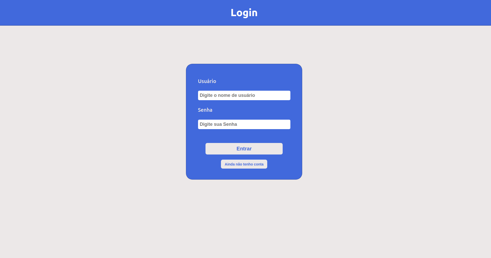
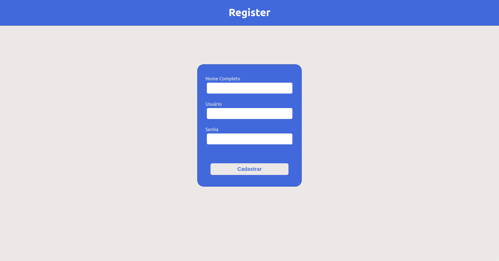
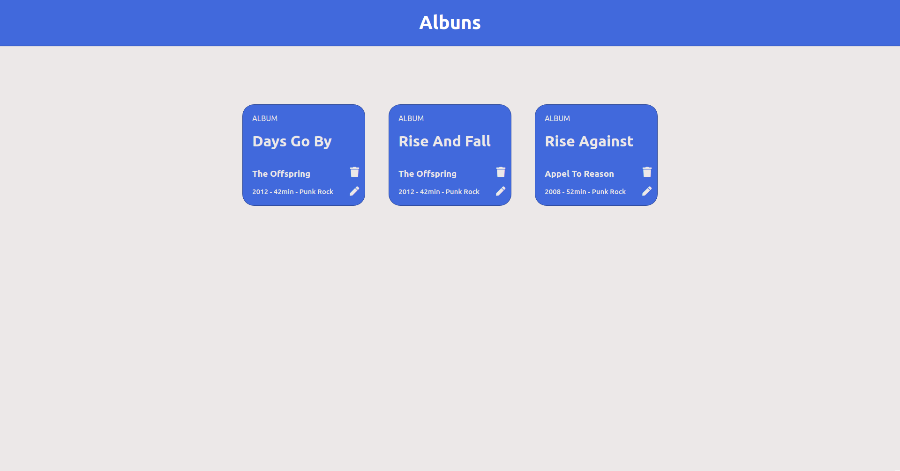
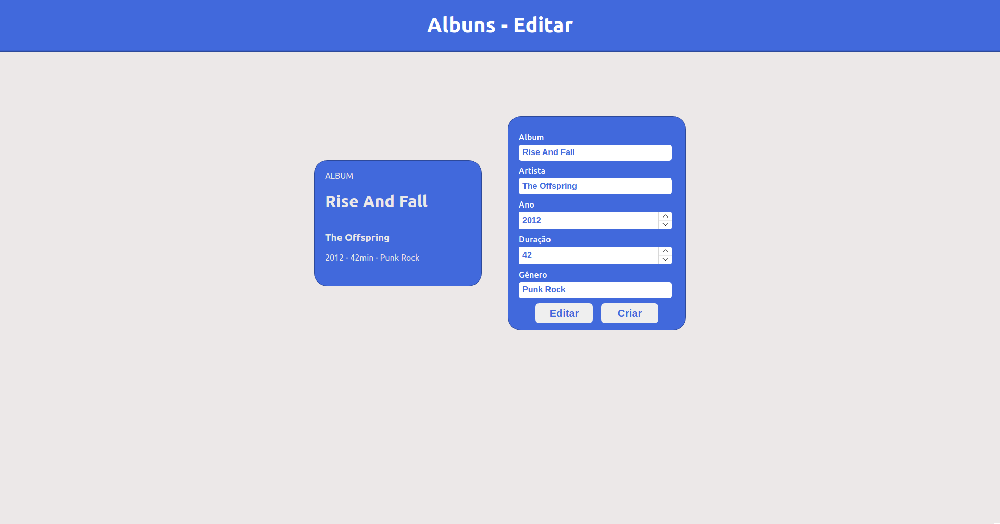
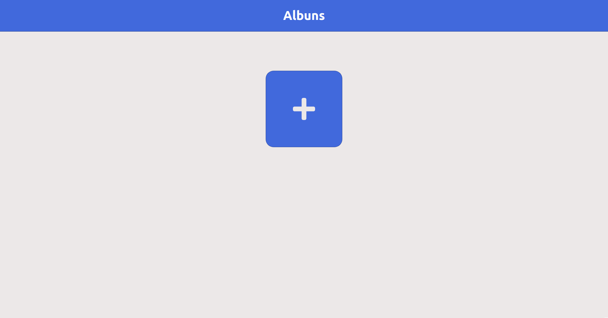
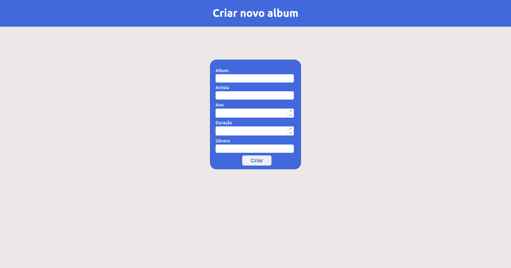

# Smart Innovation Test
Um website para cadastro de albuns de música.

## Indice
* [Screenshots](#screenshots)
* [Tecnologias](#tecnologias)
* [Instalação](#instalação)
* [Configuração](#configuração)
* [FeedBack](#feedback)

## Screenshots














## Tecnologias
<ul>
  <li><a href="https://nodejs.org/en/">Node.js</a></li>
  <li><a href="https://www.mysql.com/">MySQL</a></li>
  <li><a href="https://reactjs.org">React</a></li>
  <li><a href="https://sass-lang.com/">Sass</a></li>
</ul>

## Instalação
Assim que tiver clonado o repositório, usando o terminal do [vscode](https://code.visualstudio.com/) ou o terminal do seu sistema operacional, abra-o na pasta server.
- Installe as dependencias usando :
```
npm install
```
Execute o mesmo comando na pasta client.

Certifique-se que tem instalado o [Node](#tecnologias) e o [MySql](#tecnologias).

## Configuração

#### Criando o Database
- Assim que tiver tudo instalado, installe e abra o [MySQLWorkBench](https://www.mysql.com/products/workbench/), abra a pasta server, encontre o arquivo script.sql, copie e o execute no MySQLWorkBench.
Ou copie:
```
DROP DATABASE IF EXISTS sitest;
CREATE DATABASE IF NOT EXISTS sitest;

USE sitest;

CREATE TABLE IF NOT EXISTS accounts (
	id INT NOT NULL AUTO_INCREMENT,
    name varchar(20) NOT NULL,
    username VARCHAR(10) NOT NULL,
    password VARCHAR(50) NOT NULL,
    PRIMARY KEY (id),
    UNIQUE KEY `username` (username)
);

CREATE TABLE IF NOT EXISTS albuns (
	id INT NOT NULL AUTO_INCREMENT,
    user_id INT NOT NULL,
    album_name VARCHAR(20) NOT NULL,
    artist VARCHAR(30) NOT NULL,
    year INT(4) NOT NULL,
    gender VARCHAR(10) NOT NULL,
    duration INT(5),
    PRIMARY KEY (id),
    FOREIGN KEY (user_id) REFERENCES accounts(id)
    UNIQUE KEY `album_name` (name)
);

INSERT INTO accounts (id, name, username, password) VALUES
    ('1', 'Administrator', 'username', '123456')

INSERT INTO albuns (id, user_id, album_name, artist, year, gender, duration) VALUES
('1', '1', 'NINE', 'Blink 182', '2019', 'Pop Punk', '41')

INSERT INTO albuns (id, user_id, album_name, artist, year, gender, duration) VALUES
('2', '2', 'Days go By', 'The OffSpring', '2012', 'Punk Rock', '42')
```
E o banco de dados estará criado.

#### Configurando a Conexão
É importante que antes de tentar iniciar a aplicação configure a conexão do seu servidor com o front-end, na pasta server/models/connection.js.
```
module.exports = mysql.createPool({
  host: 'localhost',
  user: 'root',
  password: '123',
  database: 'sitest',
  port: '3306',
})
```
Veja qual a sua senha e se irá mudar o nome do banco de dados, se não, só copie e mude a senha.

#### Iniciando a aplicação
- Vá na pasta client, abra o terminal e digite ```npm start```, para iniciar a aplicação no browser, na porta 3000.
- Vá na pasta server, abra o terminal e digite ```npm run dev```, para iniciar a aplicação no browser, na porta 3000.

## Feedback 

Ficarei bem agradecido caso queira me dar um feedback costrutivo, caso queira meus contatos estarão abaixo!

Email: rods.leite27@gmail.com e <a href="https://linkedin.com/in/rodrigoleite27">Linkedin</a>.

